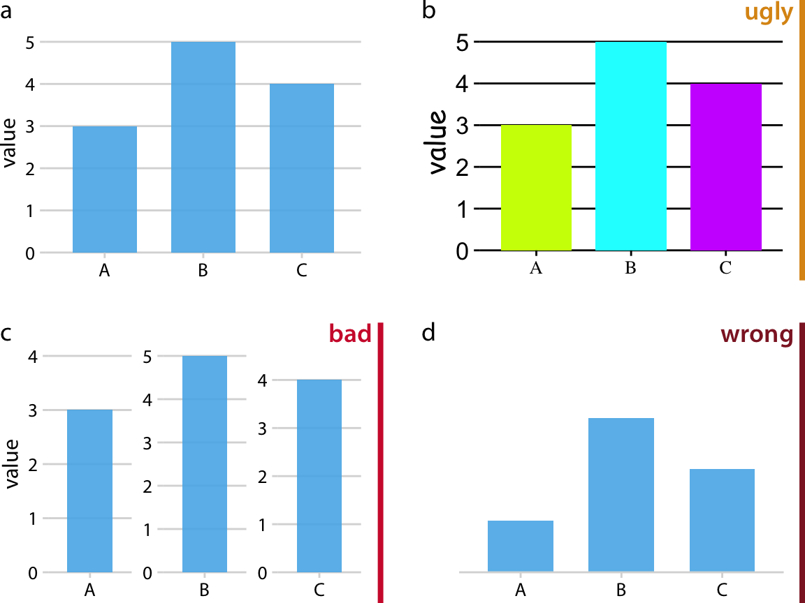
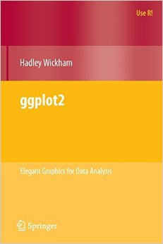

class: inverse
name: toc


```{r include=FALSE, purl=TRUE}
#specify the packages of interest
pkgs <- c("tidyverse", "moderndive", "gapminder",
          "nycflights13", "fivethirtyeight", "janitor",
          "ggplot2movies", "remotes")

# use this function to check if each package is on the local machine
# if a package is installed, it will be loaded
# if any are not, the missing package(s) will be installed and loaded
pkg.check <- function(x) {
    if (!require(x, character.only = TRUE)) {
        install.packages(x, dependencies = TRUE, repos = "https://cran.rstudio.com")
        library(x, character.only = TRUE)
    }
}
lapply(pkgs, pkg.check)

if(!require("infer"))
  remotes::install_github("andrewpbray/infer")
```

```{r echo=FALSE, purl=FALSE}
library(ggplot2)
filter <- dplyr::filter
knitr::opts_chunk$set(warning=FALSE, message=FALSE, fig.width=10.5, fig.height=4, comment=NA, rows.print=16)
theme_set(theme_gray(base_size = 24))
options(digits = 5, width = 70)

gif_link <- function(link, file, size){
    knitr::asis_output(
      paste0('<center>\n<a href="',
             link,
             '">\n\n</a>\n</center>'
      ))
}

```

# Table of Contents

- [Principles of data visualisation](#viz_principles)
- [Some common types of plots](#plot_types)
- [Data visualisation in R](#viz)
- [Other resources](#resources)

---

layout: true
class: inverse

.footer[[Return to Table of Contents](#toc)]

---

layout: true
class: inverse

---

# Acknowledgements

Dr. Chester Ismay <br><br><br> <a href="http://github.com/ismayc"><i class="fa fa-github fa-fw"></i>&nbsp; ismayc</a><br> <a href="http://twitter.com/old_man_chester"> <i class="fa fa-twitter fa-fw"></i>&nbsp; @old_man_chester</a><br><br>
  
.footer[Slides available at http://bit.ly/ness-infer &emsp; &emsp; &emsp; ]

---

# Acknowledgements

.pull-left[Claus O. Wilke <br><br><br> <a href="https://github.com/clauswilke"><i class="fa fa-github fa-fw"></i>&nbsp; clauswilke</a><br> <a href="https://twitter.com/ClausWilke"> <i class="fa fa-twitter fa-fw"></i>&nbsp; @ClausWilke</a><br><br>]
.pull-right[<br><br><br>]

.footer[https://serialmentor.com/dataviz/index.html &emsp; &emsp; &emsp; ]

---

layout: true
class: inverse

.footer[[Return to Table of Contents](#toc)]

---

name: viz_principles

# Principles of Visualisation
- Why do we use visualisations
- Some best practices

---

# Why do we use visualisations?

---

## To show a finding

```{r echo=FALSE,fig.height=5, fig.width=6, fig.align='center', purl=FALSE}
mpg %>% 
  ggplot(aes(as.factor(cyl), hwy)) +
  geom_boxplot() +
  xlab("Number of cylinders") +
  ylab("Highway miles per gallon") +
  ggtitle("Fuel efficiency")
  
```


---

## To tell a story


.small.right[Charles Joseph Minard (1869)]


---

## To make something beautiful

.center[]

---

# Why do we use visualisations?

.center.large[<br><br><span style="color:#FF0000">TO ACCURATELY EXCHANGE INFORMATION</span>]

---

# Some best practices
- Reproducibility
- Autogeneration
  - Manual editing --> irreproducibility
  - Easy to make changes
  - Future you may not know what pressent you did
- Avoid interactive plot programmes (Excel counts)

---

layout: true
class: inverse

---

# The good, the bad and the ugly 

.center[<br>]

.small.right[(https://serialmentor.com/dataviz/)]

---

# Consider your audience
- Publication
- Conference talk
- Exploratory data analysis
- Progress report to your boss

---

# Another example

.center[]

---

layout: true
class: inverse

.footer[[Return to Table of Contents](#toc)]

---

# Building a graphic

- <span style="color:#FF0000">__aes__</span>thetic mapping
- <span style="color:#FF0000">__geom__</span>etric objects
- something else

[//]: # "https://stackoverflow.com/questions/29067541/how-to-change-the-font-color"

---

layout: false
class: center, middle
name: viz

# Data Visualization

`r gif_link("https://ggplot2.tidyverse.org", "img/ggplot2_hex.png", 400)`
---

layout: true
class: inverse

.footer[[Return to Table of Contents](#toc)]

---
```{r echo=FALSE,fig.height=6.2, fig.width=10, fig.align='center', purl=FALSE}
library(gapminder)
options(scipen = 99)

gapminder %>% filter(year == 1992) %>%
  ggplot(aes(x = log(gdpPercap, base = 10), y = lifeExp, color = continent,
             size = pop)) +
  geom_point() + xlab('Gross Domestic Product (log scale)') + ylab('Life Expectancy at birth (years)') + ggtitle("Gapminder for 1992")
```

- What are the variables here?
- What is the observational unit?
- How are the variables mapped to aesthetics?

---

class: center, middle

## Grammar of Graphics

Wilkinson (2005) laid out the proposed <br> "Grammar of Graphics"

<br>

<a href="http://www.powells.com/book/the-grammar-of-graphics-9780387245447"></a>

---

class: center, middle

## Grammar of Graphics in R

Wickham implemented the grammar in R <br> in the `ggplot2` package

<br>

<a href="http://www.powells.com/book/ggplot2-elegant-graphics-for-data-analysis-9783319242750/68-428"></a>

---

class: center, middle

## Edward Tufte pioneered the field of data visualisation


---

class: center, middle


.small[Charles Joseph Minard (1869)]

---

class: center

## Another recommendation:

FUNDAMENTALS OF DATA VISUALISATION
Claus O. Wilke

https://serialmentor.com/dataviz/

---

class: center, middle

## What is a statistical graphic?

--

## A `mapping` of <br> `data` variables

--

## to <br> `aes()`thetic attributes

--

## of <br> `geom_`etric objects.

---

class: inverse, center, middle

# Back to Basics

---

## Old school

- Sketch the graphics below on paper, where the `x`-axis is variable `A` and the `y`-axis is variable `B`

```{r echo=FALSE, purl=TRUE}
simple_ex <-
  data_frame(
    A = c(1980, 1990, 2000, 2010),
    B = c(1, 2, 3, 4),
    C = c(3, 2, 1, 2),
    D = c("cold", "cold", "hot", "hot")
  )
simple_ex
```

<!-- Copy to chalkboard/whiteboard -->

1. <small>A scatter plot</small>
1. <small>A scatter plot where the `color` of the points corresponds to `D`</small>
1. <small>A scatter plot where the `size` of the points corresponds to `C`</small>

---

layout: true
class: inverse

.footer[[Return to Table of Contents](#toc)]

---

## Reproducing the plots in `ggplot2`

### 1. A scatterplot

```{r, eval=FALSE, purl=FALSE}
library(ggplot2)
ggplot(data = simple_ex, mapping = aes(x = A, y = B)) + 
  geom_point()
```
--

```{r, echo=FALSE, fig.height=4.4, purl=TRUE}
ggplot(data = simple_ex, aes(x = A, y = B)) + 
  geom_point()
```


---


## Reproducing the plots in `ggplot2`

### 2. A scatter plot where the `color` of the points corresponds to `D`

```{r, eval=FALSE, purl=FALSE}
library(ggplot2)
ggplot(data = simple_ex, mapping = aes(x = A, y = B)) + 
  geom_point(mapping = aes(color = D))
```
--

```{r, echo=FALSE, fig.height=4.4, purl=TRUE}
ggplot(data = simple_ex, mapping = aes(x = A, y = B)) + 
  geom_point(mapping = aes(color = D))
```


---

## Reproducing the plots in `ggplot2`

### 3. A scatter plot where the `size` of the points corresponds to `C`

```{r, eval=FALSE, purl=FALSE}
library(ggplot2)
ggplot(data = simple_ex, mapping = aes(x = A, y = B, size = C)) + 
  geom_point()
```
--

```{r, echo=FALSE, fig.height=4.4, purl=TRUE}
ggplot(data = simple_ex, mapping = aes(x = A, y = B, size = C)) + 
  geom_point()
```

---

# Another example

Do cars with bigger engines have lower fuel efficiency?

```{r}
mpg
```

---

```{r, fig.height=6.4, purl=TRUE}
ggplot(data = mpg) + 
  geom_point(mapping = aes(x = displ, y = hwy))
```

---

```{r, eval=FALSE, purl=FALSE}
ggplot(data = mpg) + 
  geom_point(mapping = aes(x = displ, y = hwy))
```

```
ggplot(data = <DATA>) + 
  <GEOM_FUNCTION>(mapping = aes(<MAPPINGS>))
```

---

## Exercises
1. Run `ggplot(data = mpg)`. What do you see?

2. How many rows are in mpg? How many columns?

3. What does the `drv` variable describe? Read the help for `?mpg` to find out.

4. Make a scatterplot of hwy vs cyl.

1. What happens if you make a scatterplot of class vs drv? Why is the plot not useful?

---

# Aesthetic mapping

- An aesthetic is a visual property of the objects in your plot.

- Aesthetics include things like the size, the shape, or the color of your points.

---

## Mapping to colour

```{r, fig.height=5.5, purl=TRUE}
ggplot(data = mpg) + 
  geom_point(mapping = aes(x = displ, y = hwy, color = class))
```

---

## Mapping to shape

```{r, fig.height=5.5, purl=TRUE}
ggplot(data = mpg) + 
  geom_point(mapping = aes(x = displ, y = hwy, shape = class))
```

---

## Mapping to size

```{r, fig.height=5.5, purl=TRUE}
ggplot(data = mpg) + 
  geom_point(mapping = aes(x = displ, y = hwy, size = class))
```

---

# Facets

```{r, fig.height=5, purl=TRUE}
ggplot(data = mpg) + 
  geom_point(mapping = aes(x = displ, y = hwy)) + 
  facet_wrap(~ class, nrow = 2)
```

---

# Geometric objects

A geom is the geometrical object that a plot uses to represent data. 

---

## Same data, different `geom`s

```{r echo=FALSE, purl=TRUE, fig.hold = "hold", fig.width=5}
ggplot(data = mpg) +
  geom_point(mapping = aes(x = displ, y = hwy))

ggplot(data = mpg) +
  geom_smooth(mapping = aes(x = displ, y = hwy))
```


Exercise: try to create each of these plots

(hint: use `geom_smooth` for plot on the right)

---

## Can you create this one?

```{r echo=FALSE, purl=TRUE, fig.width = 5, fig.align='center'}
ggplot(data = mpg) +
  geom_point(mapping = aes(x = displ, y = hwy)) +
  geom_smooth(mapping = aes(x = displ, y = hwy))
```

--

```{r eval=FALSE, purl=TRUE, fig.width = 5, fig.align='center'}
ggplot(data = mpg) +
  geom_point(mapping = aes(x = displ, y = hwy)) +
  geom_smooth(mapping = aes(x = displ, y = hwy))
```

---

## Introducing global mapping

```{r eval=FALSE, purl=FALSE, fig.width = 5, fig.align='center'}
ggplot(data = mpg) +
  geom_point(mapping = aes(x = displ, y = hwy)) +
  geom_smooth(mapping = aes(x = displ, y = hwy))
```

--

```{r eval=FALSE, purl=FALSE}
ggplot(data = mpg, mapping = aes(x = displ, y = hwy)) +
  geom_point() +
  geom_smooth()
```

--

```{r eval=FALSE, purl=FALSE}
ggplot(mpg, aes(displ,hwy)) +
  geom_point() +
  geom_smooth()
```

---

## Local mappings overwrite global mappings for that _that layer only_

```{r purl=TRUE, fig.width=5, fig.align='center'}
ggplot(data = mpg, mapping = aes(x = displ, y = hwy)) +
  geom_point() +
  geom_point(data = filter(mpg, class == "2seater"), colour = "red") 
```

---

# [The Five-Named Graphs](http://moderndive.com/3-viz.html#FiveNG)

## The 5NG of data viz

- Scatterplot: `geom_point()`
- Line graph: `geom_line()`
- Histogram: `geom_histogram()`
- Boxplot: `geom_boxplot()`
- Bar graph: `geom_bar()`


---

class: center, middle

## More examples

---

## Histogram

```{r fig.height=5.5, purl=TRUE}
library(nycflights13)
ggplot(data = weather, mapping = aes(x = humid)) +
  geom_histogram(bins = 20, color = "black", fill = "darkorange")
```

---

## Boxplot (broken)

```{r fig.height=5.5, purl=TRUE}
library(nycflights13)
ggplot(data = weather, mapping = aes(x = month, y = humid)) +
  geom_boxplot()
```

---


## Boxplot (fixed)

```{r fig.height=5.5, purl=TRUE}
library(nycflights13)
ggplot(data = weather, mapping = aes(x = factor(month), y = humid)) +
  geom_boxplot()
```

---

## Bar graph

```{r fig.height=5.5, purl=TRUE}
library(fivethirtyeight)
ggplot(data = bechdel, mapping = aes(x = clean_test)) +
  geom_bar()
```

---

## How about over time?

- One more variable to create with `dplyr`

```{r, purl=TRUE}
library(dplyr)
year_bins <- c("'70-'74", "'75-'79", "'80-'84", "'85-'89",
               "'90-'94", "'95-'99", "'00-'04", "'05-'09",
               "'10-'13")
bechdel <- bechdel %>%
  mutate(five_year = cut(year, 
                         breaks = seq(1969, 2014, 5), 
                         labels = year_bins))
```

---

## How about over time? (Stacked)

```{r fig.width=11, fig.height=4.8, purl=TRUE}
library(fivethirtyeight)
library(ggplot2)
ggplot(data = bechdel,
       mapping = aes(x = five_year, fill = clean_test)) +
  geom_bar() +
  scale_fill_brewer(type = "qual") # set colors
```

---

## How about over time? (Side-by-side)

```{r fig.width=11, fig.height=4.8, purl=TRUE}
library(fivethirtyeight)
library(ggplot2)
ggplot(data = bechdel,
       mapping = aes(x = five_year, fill = clean_test)) +
  geom_bar(position = "dodge") +
  scale_fill_brewer(type = "qual")
```

---

## How about over time? (Stacked proportional)

```{r fig.width=11, fig.height=4.7, purl=TRUE}
library(fivethirtyeight)
library(ggplot2)
ggplot(data = bechdel,
       mapping = aes(x = five_year, fill = clean_test)) +
  geom_bar(position = "fill", color = "black") +
  scale_fill_brewer(type = "qual")
```

---

## Practice

Produce appropriate 5NG with R package & data set in [ ], e.g., [`nycflights13::weather`] 

<!--
Try to look through the help documentation/Google to improve your plots
-->

1. How does `age` predict `recline_rude`? <br> [`fivethirtyeight::flying`]

2. Distribution of log base 10 scale of `budget_2013` <br> [`fivethirtyeight::bechdel`]

3. How does `budget` predict `rating`? <br> [`ggplot2movies::movies`]

---

### HINTS

```{r echo=FALSE, fig.height=7, fig.width=10.5, purl=FALSE}
library(gridExtra)
library(fivethirtyeight)
library(ggplot2movies)
#library(okcupiddata)

p1 <- ggplot(data = na.omit(flying), mapping = aes(fill = recline_rude, x = age)) + geom_bar(position = "fill") +
  scale_fill_brewer(type = "qual") +
  ggtitle("Problem 1") + theme_gray(base_size = 20)

#p2 <- ggplot(data = profiles, mapping = aes(x = sex, y = age)) +
#  geom_boxplot() + ggtitle("Problem 2") + theme_gray(base_size = 20)

p3 <- ggplot(data = movies, mapping = aes(x = budget, y = rating)) +
  geom_point() + ggtitle("Problem 3") + theme_gray(base_size = 20)

p2 <- ggplot(data = bechdel, mapping = aes(x = log(budget_2013, 10))) +
  geom_histogram(color = "white", bins = 10) + ggtitle("Problem 2") +
  theme_gray(base_size = 20)

grid.arrange(p1, #p2, 
             p2, p3, ncol = 2, padding = unit(0.5, "line"),
             widths = c(2.6, 1.8))

```

---

class: center, middle

### Determining the appropriate plot

<a href="https://coggle.it/diagram/V_G2gzukTDoQ-aZt"></a>

---

## Some good resources for data visualisation

- [FUNDAMENTALS OF DATA VISUALISATION](https://serialmentor.com/dataviz/)
Claus O. Wilke
    + https://serialmentor.com/dataviz/
- [awesome-python](https://github.com/vinta/awesome-python#data-visualization)
    + https://github.com/vinta/awesome-python#data-visualization
- [Flowing data](http://flowingdata.com/)
    + http://flowingdata.com/
- [Tidy Tuesday](https://github.com/rfordatascience/tidytuesday)
    + https://github.com/rfordatascience/tidytuesday
    
---

# Review

- Write the code to produce this plot for 2007 data

```{r echo=FALSE, fig.height=5.5, fig.width=10, purl=TRUE}
library(gapminder)
library(tidyverse)
gapminder_2007 <- gapminder %>% filter(year == 2007)
ggplot(data = gapminder_2007, 
       mapping = aes(x = gdpPercap, y = lifeExp, 
                     size = pop, color = continent)) +
  geom_point()
```

---

```{r fig.height=5.5, fig.width=10, purl=TRUE}
library(gapminder)
library(tidyverse)
gapminder_2007 <- gapminder %>% filter(year == 2007)
ggplot(data = gapminder_2007, 
       mapping = aes(x = gdpPercap, y = lifeExp, 
                     size = pop, color = continent)) +
  geom_point()
```

---

layout: true
class: inversekj

.footer[[Return to Table of Contents](#toc)]

---

layout: false
class: inverse, center, middle

# Thank you!

---

layout: false
class: inverse, middle

.center.large[Thanks for attending!]
<br>
Contact me: 
- jonathan.leslie@pivigo.com
- https://twitter.com/jlesliedata
<br><br>

Special thanks to Chester Ismay 
- https://twitter.com/old_man_chester
- Slides' source code at <https://github.com/ismayc/talks/>
<br><br>
- Slides created via the R package [xaringan](https://github.com/yihui/xaringan) by Yihui Xie

