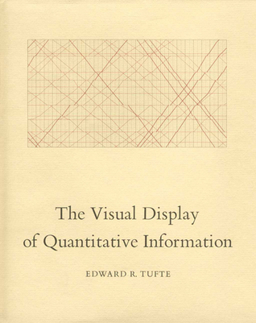

class: inverse
name: toc


```{r include=FALSE, purl=TRUE}
#specify the packages of interest
pkgs <- c("tidyverse", "moderndive", "gapminder",
          "nycflights13", "fivethirtyeight", "janitor",
          "ggplot2movies", "remotes")

# use this function to check if each package is on the local machine
# if a package is installed, it will be loaded
# if any are not, the missing package(s) will be installed and loaded
pkg.check <- function(x) {
    if (!require(x, character.only = TRUE)) {
        install.packages(x, dependencies = TRUE, repos = "https://cran.rstudio.com")
        library(x, character.only = TRUE)
    }
}
lapply(pkgs, pkg.check)

if(!require("infer"))
  remotes::install_github("andrewpbray/infer")
```

```{r echo=FALSE, purl=FALSE}
library(ggplot2)
filter <- dplyr::filter
knitr::opts_chunk$set(warning=FALSE, message=FALSE, fig.width=10.5, fig.height=4, comment=NA, rows.print=16)
theme_set(theme_gray(base_size = 24))
options(digits = 5, width = 70)

gif_link <- function(link, file, size){
    knitr::asis_output(
      paste0('<center>\n<a href="',
             link,
             '">\n\n</a>\n</center>'
      ))
}

```

# Table of Contents

Part 1
- [Why R?](#whyR)
- [A tour of RStudio](#tour)
- [Getting started with R](#getting_started)
- [Data wrangling](#wrangling)

Part 2
- [Data visualization](#viz)
- [Data tidying](#tidying)
- [Exploratory data analysis](#eda)

---

layout: true
class: inverse

.footer[[Return to Table of Contents](#toc)]

---
name: whyR

# Why R?

- Open source
- Powerful statistics
- Outstanding for plotting
- Shiny dashboards
- Community

---

layout: true
class: inverse

---

## Acknowledgement

Dr. Chester Ismay <br> Senior Curriculum Lead at <a href="https://www.datacamp.com/">DataCamp</a> <br><br> <a href="http://github.com/ismayc"><i class="fa fa-github fa-fw"></i>&nbsp; ismayc</a><br> <a href="http://twitter.com/old_man_chester"> <i class="fa fa-twitter fa-fw"></i>&nbsp; @old_man_chester</a><br> <a href="mailto:chester@datacamp.com"><i class="fa fa-paper-plane fa-fw"></i>&nbsp; chester@datacamp.com</a><br>
  
.footer[Slides available at http://bit.ly/ness-infer &emsp; &emsp; &emsp; ]

---

layout: true
class: inverse

.footer[[Return to Table of Contents](#toc)]

---

class: normal, center, middle

## \#rstats


---

class: normal, center, middle

## R4DS learning community


---

class: normal, center
name: tour

# A tour of RStudio

---

## Designed for the novice / Nice for the practioner

`r gif_link("http://moderndive.netlify.com/2-getting-started.html", "img/engine.png", 600)`

---

## Designed for the novice / Nice for the practioner

`r gif_link("http://moderndive.netlify.com/2-getting-started.html", "img/appstore.png", 620)`

---

class: normal, center, middle
GO TO RSTUDIO

---

## Prior Installation

Make sure you have the (current) up-to-date R, RStudio, and R packages
- [Beginner's Guide](http://moderndive.com/2-getting-started.html) on ModernDive.com

***

- [R (version 3.4.4)](https://cran.r-project.org/)
- [RStudio (version 1.1.442)](https://www.rstudio.com/products/rstudio/download3/)

- Run this in the RStudio Console

```{r, eval=FALSE, purl=FALSE}
pkgs <- c("tidyverse", "moderndive", "gapminder",
          "nycflights13", "fivethirtyeight", "janitor",
          "ggplot2movies", "remotes")

install.packages(pkgs)
remotes::install_github("andrewpbray/infer")
```

---

## R for Data Science


- [Link for the book is here](http://r4ds.had.co.nz/)

---

## Freely available information

`r gif_link("http://moderndive.com", "img/wide_format.png", 650)`

<center><h2>A Modern Dive into Data with R</h2></center>

* Webpage: <http://moderndive.com>
* Developmental version at <https://moderndive.netlify.com>
* [GitHub Repo](https://github.com/moderndive/moderndiver-book)
* Please [signup](http://eepurl.com/cBkItf) for our mailing list!

---

layout: true
class: inverse
.footer[[Return to Table of Contents](#toc)]

---

name: getting_started

# Getting started with R

---

class: normal, center, middle

# R Data Types

---

## The bare minimum needed for understanding today

Vector/variable
  - Type of vector (`int`, `num` or `dbl`, `chr`, `lgl`, `date`)

--

Data frame
  - Vectors of (potentially) different types
  - Each vector has the same number of rows

---

## The bare minimum needed for understanding today

```{r eval=FALSE, purl=FALSE}
library(tibble)
library(lubridate)
ex1 <- data_frame(
    vec1 = c(1980, 1990, 2000, 2010),
    vec2 = c(1L, 2L, 3L, 4L),
    vec3 = c("low", "low", "high", "high"),
    vec4 = c(TRUE, FALSE, FALSE, FALSE),
    vec5 = ymd(c("2017-05-23", "1776/07/04", 
                 "1983-05/31", "1908/04-01"))
  )
ex1
```

--

```{r echo=FALSE, purl=TRUE}
library(tibble)
library(lubridate)
ex1 <- data_frame(
    vec1 = c(1980, 1990, 2000, 2010),
    vec2 = c(1L, 2L, 3L, 4L),
    vec3 = c("low", "low", "high", "high"),
    vec4 = c(TRUE, FALSE, FALSE, FALSE),
    vec5 = ymd(c("2017-05-23", "1776/7/04", "1983-5/31", "1908/04-1"))
  )
ex1
```
  
---

class: center, middle  
  
# Welcome to the [tidyverse](https://blog.rstudio.org/2016/09/15/tidyverse-1-0-0/)!
  
The `tidyverse` is a collection of R packages that share common philosophies and are designed to work together. <br><br> 
  
<a href="http://tidyverse.tidyverse.org/logo.png"></a>

---

# First motivating example for today

<a href="http://gitsense.github.io/images/wealth.gif"></a>

- Inspired by the late, great [Hans Rosling](https://www.youtube.com/watch?v=jbkSRLYSojo)


---

layout: false
class: center, middle
name: wrangling

# Data Wrangling

`r gif_link("https://dplyr.tidyverse.org", "img/dplyr_hex.png", 400)`

---

layout: true
class: inverse

.footer[[Return to Table of Contents](#toc)]

---

## The [`gapminder` package](https://github.com/jennybc/gapminder)

```{r, purl=TRUE}
library(gapminder)
gapminder
```


---

## Base R versus the `tidyverse`

- The mean life expectancy across all years for Asia
--

```{r, purl=TRUE}
# Base R
asia <- gapminder[gapminder$continent == "Asia", ]
mean(asia$lifeExp)
```
--
 
```{r eval=FALSE, purl=FALSE}
library(dplyr)
gapminder %>% filter(continent == "Asia") %>%
  summarize(mean_exp = mean(lifeExp))
```

```{r echo=FALSE, purl=TRUE}
library(dplyr)
gapminder %>% filter(continent == "Asia") %>%
  summarize(mean_exp = as.numeric(format(mean(lifeExp), digits = 5))) %>% 
  pull()
```


---

## The pipe `%>%`

 &emsp; &emsp; &emsp; 
--

- A way to chain together commands
- Can be read as "and then" when reading over code
--

```{r eval=FALSE, purl=FALSE}
library(dplyr)
gapminder %>% filter(continent == "Asia") %>%
  summarize(mean_exp = mean(lifeExp))
```

---

name: fivemv

# [The Five Main Verbs (5MV)](http://moderndive.com/5-wrangling.html) of data wrangling

- [`filter()`](#filter) 
- [`summarize()`](#summarize)
- [`group_by()`](#groupby)
- [`mutate()`](#mutate) 
- [`arrange()`](#arrange)

---

name: filter

## `filter()`

- Select a subset of the rows of a data frame. 

- Arguments are "filters" that you'd like to apply.
--

```{r, purl=TRUE}
library(gapminder); library(dplyr)
gap_2007 <- gapminder %>% filter(year == 2007)
head(gap_2007, 4)
```

- Use `==` to compare a variable to a value

---

## Logical operators

- Use `|` to check for any in multiple filters being true:
--

```{r eval=FALSE, purl=FALSE}
gapminder %>% 
  filter(year == 2002 | continent == "Asia") %>% 
  sample_n(8)
```
--

```{r echo=FALSE, purl=TRUE}
set.seed(2018)
gapminder %>% 
  filter(year == 2002 | continent == "Asia") %>% 
  sample_n(8)
```

---

## Logical operators

- Use `,` to check for all of multiple filters being true:
--

```{r eval=FALSE, purl=FALSE}
gapminder %>% 
  filter(year == 2002, continent == "Asia")
```

```{r echo=FALSE, purl=TRUE}
gapminder %>% 
  filter(year == 2002, continent == "Asia") %>% 
  head(8)
```

---

## Logical operators

- Use `%in%` to check for any being true <br> (shortcut to using `|` repeatedly with `==`)
--

```{r eval=FALSE, purl=FALSE}
gapminder %>% 
  filter(country %in% c("Argentina", "Belgium", "Mexico"),
         year %in% c(1987, 1992))
```
--

```{r echo=FALSE, purl=TRUE}
gapminder %>% 
  filter(country %in% c("Argentina", "Belgium", "Mexico"),
         year %in% c(1987, 1992))
```


---

name: summarize

## `summarize()`

- Any numerical summary that you want to apply to a column of a data frame is specified within `summarize()`.

```{r eval=FALSE, purl=FALSE}
stats_1997 <- gapminder %>% 
  filter(year == 1997) %>% 
  summarize(max_exp = max(lifeExp),
            sd_exp = sd(lifeExp))
stats_1997
```
--

```{r echo=FALSE, purl=TRUE}
stats_1997 <- gapminder %>% 
  filter(year == 1997) %>% 
  summarize(max_exp = max(lifeExp),
            sd_exp = sd(lifeExp))
stats_1997
```

---

name: groupby

### Combining `summarize()` with `group_by()`

When you'd like to determine a numerical summary for all
levels of a different categorical variable

```{r eval=FALSE, purl=FALSE}
max_exp_1997_by_cont <- gapminder %>% 
  filter(year == 1997) %>% 
  group_by(continent) %>%
  summarize(max_exp = max(lifeExp),
            sd_exp = sd(lifeExp))
max_exp_1997_by_cont
```

--
```{r echo=FALSE, purl=TRUE}
max_exp_1997_by_cont <- gapminder %>% 
  filter(year == 1997) %>% 
  group_by(continent) %>%
  summarize(max_exp = max(lifeExp),
            sd_exp = sd(lifeExp))
max_exp_1997_by_cont
```

---

name: mutate

## `mutate()`

- Allows you to 
    1. <font color="yellow">create a new variable with a specific value</font> OR
    2. create a new variable based on other variables OR
    3. change the contents of an existing variable

--

```{r, purl=TRUE}
gap_plus <- gapminder %>% mutate(just_one = 1)
head(gap_plus, 4)
```

---

## `mutate()`

- Allows you to 
    1. create a new variable with a specific value OR
    2. <font color="yellow">create a new variable based on other variables</font> OR
    3. change the contents of an existing variable

--

```{r echo=FALSE, purl=TRUE}
set.seed(2)
```


```{r, purl=TRUE}
gap_w_gdp <- gapminder %>% mutate(gdp = pop * gdpPercap)
sample_n(gap_w_gdp, 4)
```

---

## `mutate()`

- Allows you to 
    1. create a new variable with a specific value OR
    2. create a new variable based on other variables OR
    3. <font color="yellow">change the contents of an existing variable</font>

--

```{r, purl=TRUE}
gap_weird <- gapminder %>% mutate(pop = pop + 1000)
head(gap_weird, 4)
```

---

name: arrange

## `arrange()`

- Reorders the rows in a data frame based on the values of one or more variables
--

```{r, purl=TRUE}
gapminder %>% arrange(year, country) %>% head(10)
```

---

## `arrange()`

- Can also put into descending order
--

```{r desc, purl=TRUE}
gapminder %>%
  filter(year > 2000) %>%
  arrange(desc(lifeExp)) %>%
  head(10)
```

---

## Don't mix up `arrange` and `group_by`

- `group_by` is used (mostly) with `summarize` to calculate summaries over groups

- `arrange` is used for sorting

---

## Don't mix up `arrange` and `group_by`

This doesn't really do anything useful

```{r purl=TRUE}
gapminder %>% group_by(year)
```

---

## Don't mix up `arrange` and `group_by`

But this does

```{r purl=TRUE}
gapminder %>% arrange(year)
```

---

## Practice

Use the [5MV](#fivemv) to answer problems from R data packages, e.g., [`nycflights13::weather`] 

<!--
Lay out what the resulting table should look like on paper first.
-->

1. What is the maximum arrival delay for each carrier departing JFK? [`nycflights13::flights`]

2. Which carrier has the worst delays (mean arrival delay)?

3. What airline corresponds to the "F9" carrier code? 
Use [`nycflights13::airlines`]

---

## Challenge

What is the following code doing?

```{r, eval = FALSE}
flights %>% 
  select(year:day, ends_with("delay")) %>% 
  group_by(year, month, day) %>%
  filter(rank(desc(arr_delay)) < 10) 
```

---

layout: false
class: center, middle
name: viz

# Data Visualization

`r gif_link("https://ggplot2.tidyverse.org", "img/ggplot2_hex.png", 400)`
---

layout: true
class: inverse

.footer[[Return to Table of Contents](#toc)]

---
```{r echo=FALSE,fig.height=6.2, fig.width=10, fig.align='center', purl=FALSE}
library(gapminder)
options(scipen = 99)

gapminder %>% filter(year == 1992) %>%
  ggplot(aes(x = log(gdpPercap, base = 10), y = lifeExp, color = continent,
             size = pop)) +
  geom_point() + xlab('Gross Domestic Product (log scale)') + ylab('Life Expectancy at birth (years)') + ggtitle("Gapminder for 1992")
```

- What are the variables here?
- What is the observational unit?
- How are the variables mapped to aesthetics?

---

class: center, middle

## Grammar of Graphics

Wilkinson (2005) laid out the proposed <br> "Grammar of Graphics"

<br>

<a href="http://www.powells.com/book/the-grammar-of-graphics-9780387245447"></a>

---

class: center, middle

## Grammar of Graphics in R

Wickham implemented the grammar in R <br> in the `ggplot2` package

<br>

<a href="http://www.powells.com/book/ggplot2-elegant-graphics-for-data-analysis-9783319242750/68-428"></a>

---

class: center, middle

## Edward Tufte pioneered the field of data visualisation



---

class: center, middle


---

class: center

## Another recommendation:

Online preview for [FUNDAMENTALS OF DATA VISUALISATION](https://serialmentor.com/dataviz/)
Claus O. Wilke

https://serialmentor.com/dataviz/

---

class: center, middle

## What is a statistical graphic?

--

## A `mapping` of <br> `data` variables

--

## to <br> `aes()`thetic attributes

--

## of <br> `geom_`etric objects.

---

class: inverse, center, middle

# Back to Basics

---

## Old school

- Sketch the graphics below on paper, where the `x`-axis is variable `A` and the `y`-axis is variable `B`

```{r echo=FALSE, purl=TRUE}
simple_ex <-
  data_frame(
    A = c(1980, 1990, 2000, 2010),
    B = c(1, 2, 3, 4),
    C = c(3, 2, 1, 2),
    D = c("cold", "cold", "hot", "hot")
  )
simple_ex
```

<!-- Copy to chalkboard/whiteboard -->

1. <small>A scatter plot</small>
1. <small>A scatter plot where the `color` of the points corresponds to `D`</small>
1. <small>A scatter plot where the `size` of the points corresponds to `C`</small>

---

layout: true
class: inverse

.footer[[Return to Table of Contents](#toc)]

---

## Reproducing the plots in `ggplot2`

### 1. A scatterplot

```{r, eval=FALSE, purl=FALSE}
library(ggplot2)
ggplot(data = simple_ex, mapping = aes(x = A, y = B)) + 
  geom_point()
```
--

```{r, echo=FALSE, fig.height=4.4, purl=TRUE}
ggplot(data = simple_ex, aes(x = A, y = B)) + 
  geom_point()
```


---


## Reproducing the plots in `ggplot2`

### 2. A scatter plot where the `color` of the points corresponds to `D`

```{r, eval=FALSE, purl=FALSE}
library(ggplot2)
ggplot(data = simple_ex, mapping = aes(x = A, y = B)) + 
  geom_point(mapping = aes(color = D))
```
--

```{r, echo=FALSE, fig.height=4.4, purl=TRUE}
ggplot(data = simple_ex, mapping = aes(x = A, y = B)) + 
  geom_point(mapping = aes(color = D))
```


---

## Reproducing the plots in `ggplot2`

### 3. A scatter plot where the `size` of the points corresponds to `C`

```{r, eval=FALSE, purl=FALSE}
library(ggplot2)
ggplot(data = simple_ex, mapping = aes(x = A, y = B, size = C)) + 
  geom_point()
```
--

```{r, echo=FALSE, fig.height=4.4, purl=TRUE}
ggplot(data = simple_ex, mapping = aes(x = A, y = B, size = C)) + 
  geom_point()
```

---

# Another example

Do cars with bigger engines have lower fuel efficiency?

```{r}
mpg
```

---

```{r, fig.height=6.4, purl=TRUE}
ggplot(data = mpg) + 
  geom_point(mapping = aes(x = displ, y = hwy))
```

---

```{r, eval=FALSE, purl=FALSE}
ggplot(data = mpg) + 
  geom_point(mapping = aes(x = displ, y = hwy))
```

```
ggplot(data = <DATA>) + 
  <GEOM_FUNCTION>(mapping = aes(<MAPPINGS>))
```

---

## Exercises
1. Run `ggplot(data = mpg)`. What do you see?

2. How many rows are in mpg? How many columns?

3. What does the `drv` variable describe? Read the help for `?mpg` to find out.

4. Make a scatterplot of hwy vs cyl.

1. What happens if you make a scatterplot of class vs drv? Why is the plot not useful?

---

# Aesthetic mapping

- An aesthetic is a visual property of the objects in your plot.

- Aesthetics include things like the size, the shape, or the color of your points.

---

## Mapping to colour

```{r, fig.height=5.5, purl=TRUE}
ggplot(data = mpg) + 
  geom_point(mapping = aes(x = displ, y = hwy, color = class))
```

---

## Mapping to shape

```{r, fig.height=5.5, purl=TRUE}
ggplot(data = mpg) + 
  geom_point(mapping = aes(x = displ, y = hwy, shape = class))
```

---

## Mapping to size

```{r, fig.height=5.5, purl=TRUE}
ggplot(data = mpg) + 
  geom_point(mapping = aes(x = displ, y = hwy, size = class))
```

---

# Facets

```{r, fig.height=5, purl=TRUE}
ggplot(data = mpg) + 
  geom_point(mapping = aes(x = displ, y = hwy)) + 
  facet_wrap(~ class, nrow = 2)
```

---

# Geometric objects

A geom is the geometrical object that a plot uses to represent data. 

---

## Same data, different `geom`s

```{r echo=FALSE, purl=TRUE, fig.hold = "hold", fig.width=5}
ggplot(data = mpg) +
  geom_point(mapping = aes(x = displ, y = hwy))

ggplot(data = mpg) +
  geom_smooth(mapping = aes(x = displ, y = hwy))
```


Exercise: try to create each of these plots

(hint: use `geom_smooth` for plot on the right)

---

## Can you create this one?

```{r echo=FALSE, purl=TRUE, fig.width = 5, fig.align='center'}
ggplot(data = mpg) +
  geom_point(mapping = aes(x = displ, y = hwy)) +
  geom_smooth(mapping = aes(x = displ, y = hwy))
```

--

```{r eval=FALSE, purl=TRUE, fig.width = 5, fig.align='center'}
ggplot(data = mpg) +
  geom_point(mapping = aes(x = displ, y = hwy)) +
  geom_smooth(mapping = aes(x = displ, y = hwy))
```

---

## Introducing global mapping

```{r eval=FALSE, purl=FALSE, fig.width = 5, fig.align='center'}
ggplot(data = mpg) +
  geom_point(mapping = aes(x = displ, y = hwy)) +
  geom_smooth(mapping = aes(x = displ, y = hwy))
```

--

```{r eval=FALSE, purl=FALSE}
ggplot(data = mpg, mapping = aes(x = displ, y = hwy)) +
  geom_point() +
  geom_smooth()
```

--

```{r eval=FALSE, purl=FALSE}
ggplot(mpg, aes(displ,hwy)) +
  geom_point() +
  geom_smooth()
```

---

## Local mappings overwrite global mappings for that _that layer only_

```{r purl=TRUE, fig.width=5, fig.align='center'}
ggplot(data = mpg, mapping = aes(x = displ, y = hwy)) +
  geom_point() +
  geom_point(data = filter(mpg, class == "2seater"), colour = "red") 
```

---

# [The Five-Named Graphs](http://moderndive.com/3-viz.html#FiveNG)

## The 5NG of data viz

- Scatterplot: `geom_point()`
- Line graph: `geom_line()`
- Histogram: `geom_histogram()`
- Boxplot: `geom_boxplot()`
- Bar graph: `geom_bar()`


---

class: center, middle

## More examples

---

## Histogram

```{r fig.height=5.5, purl=TRUE}
library(nycflights13)
ggplot(data = weather, mapping = aes(x = humid)) +
  geom_histogram(bins = 20, color = "black", fill = "darkorange")
```

---

## Boxplot (broken)

```{r fig.height=5.5, purl=TRUE}
library(nycflights13)
ggplot(data = weather, mapping = aes(x = month, y = humid)) +
  geom_boxplot()
```

---


## Boxplot (fixed)

```{r fig.height=5.5, purl=TRUE}
library(nycflights13)
ggplot(data = weather, mapping = aes(x = factor(month), y = humid)) +
  geom_boxplot()
```

---

## Bar graph

```{r fig.height=5.5, purl=TRUE}
library(fivethirtyeight)
ggplot(data = bechdel, mapping = aes(x = clean_test)) +
  geom_bar()
```

---

## How about over time?

- One more variable to create with `dplyr`

```{r, purl=TRUE}
library(dplyr)
year_bins <- c("'70-'74", "'75-'79", "'80-'84", "'85-'89",
               "'90-'94", "'95-'99", "'00-'04", "'05-'09",
               "'10-'13")
bechdel <- bechdel %>%
  mutate(five_year = cut(year, 
                         breaks = seq(1969, 2014, 5), 
                         labels = year_bins))
```

---

## How about over time? (Stacked)

```{r fig.width=11, fig.height=4.8, purl=TRUE}
library(fivethirtyeight)
library(ggplot2)
ggplot(data = bechdel,
       mapping = aes(x = five_year, fill = clean_test)) +
  geom_bar() +
  scale_fill_brewer(type = "qual") # set colors
```

---

## How about over time? (Side-by-side)

```{r fig.width=11, fig.height=4.8, purl=TRUE}
library(fivethirtyeight)
library(ggplot2)
ggplot(data = bechdel,
       mapping = aes(x = five_year, fill = clean_test)) +
  geom_bar(position = "dodge") +
  scale_fill_brewer(type = "qual")
```

---

## How about over time? (Stacked proportional)

```{r fig.width=11, fig.height=4.7, purl=TRUE}
library(fivethirtyeight)
library(ggplot2)
ggplot(data = bechdel,
       mapping = aes(x = five_year, fill = clean_test)) +
  geom_bar(position = "fill", color = "black") +
  scale_fill_brewer(type = "qual")
```

---

## Practice

Produce appropriate 5NG with R package & data set in [ ], e.g., [`nycflights13::weather`] 

<!--
Try to look through the help documentation/Google to improve your plots
-->

1. How does `age` predict `recline_rude`? <br> [`fivethirtyeight::flying`]

2. Distribution of log base 10 scale of `budget_2013` <br> [`fivethirtyeight::bechdel`]

3. How does `budget` predict `rating`? <br> [`ggplot2movies::movies`]

---

### HINTS

```{r echo=FALSE, fig.height=7, fig.width=10.5, purl=FALSE}
library(gridExtra)
library(fivethirtyeight)
library(ggplot2movies)
#library(okcupiddata)

p1 <- ggplot(data = na.omit(flying), mapping = aes(fill = recline_rude, x = age)) + geom_bar(position = "fill") +
  scale_fill_brewer(type = "qual") +
  ggtitle("Problem 1") + theme_gray(base_size = 20)

#p2 <- ggplot(data = profiles, mapping = aes(x = sex, y = age)) +
#  geom_boxplot() + ggtitle("Problem 2") + theme_gray(base_size = 20)

p3 <- ggplot(data = movies, mapping = aes(x = budget, y = rating)) +
  geom_point() + ggtitle("Problem 3") + theme_gray(base_size = 20)

p2 <- ggplot(data = bechdel, mapping = aes(x = log(budget_2013, 10))) +
  geom_histogram(color = "white", bins = 10) + ggtitle("Problem 2") +
  theme_gray(base_size = 20)

grid.arrange(p1, #p2, 
             p2, p3, ncol = 2, padding = unit(0.5, "line"),
             widths = c(2.6, 1.8))

```

---

class: center, middle

### Determining the appropriate plot

<a href="https://coggle.it/diagram/V_G2gzukTDoQ-aZt"></a>

---

## Some good resources for data visualisation

- [FUNDAMENTALS OF DATA VISUALISATION](https://serialmentor.com/dataviz/)
Claus O. Wilke
    + https://serialmentor.com/dataviz/
- [awesome-python](https://github.com/vinta/awesome-python#data-visualization)
    + https://github.com/vinta/awesome-python#data-visualization
- [Flowing data](http://flowingdata.com/)
    + http://flowingdata.com/
- [Tidy Tuesday](https://github.com/rfordatascience/tidytuesday)
    + https://github.com/rfordatascience/tidytuesday
    
---

# Review

- Write the code to produce this plot for 2007 data

```{r echo=FALSE, fig.height=5.5, fig.width=10, purl=TRUE}
library(gapminder)
library(tidyverse)
gapminder_2007 <- gapminder %>% filter(year == 2007)
ggplot(data = gapminder_2007, 
       mapping = aes(x = gdpPercap, y = lifeExp, 
                     size = pop, color = continent)) +
  geom_point()
```

---

```{r fig.height=5.5, fig.width=10, purl=TRUE}
library(gapminder)
library(tidyverse)
gapminder_2007 <- gapminder %>% filter(year == 2007)
ggplot(data = gapminder_2007, 
       mapping = aes(x = gdpPercap, y = lifeExp, 
                     size = pop, color = continent)) +
  geom_point()
```

---

layout: false
class: center, middle
name: tidying

# Data Tidying

`r gif_link("https://tidyr.tidyverse.org", "img/tidyr_hex.png", 380)`

---

layout: true
class: inverse

.footer[[Return to Table of Contents](#toc)]

---

# Tidy Data?


1. Each variable forms a column.
2. Each observation forms a row.
3. Each type of observational unit forms a table.

The third point means we don't mix apples and oranges.

---

## What is Tidy Data?

1. Each observation forms a row. In other words, each row corresponds to a single instance of an <u>observational unit</u>
1. Each variable forms a column:
    + Some variables may be used to identify the <u>observational units</u>. 
    + For organizational purposes, it's generally better to put these in the left-hand columns
1. Each type of observational unit forms a table.

---

## Differentiating between <u>neat</u> data and <u>tidy</u> data

- Colloquially, they mean the same thing
- But in our context, one is a subset of the other. 

<br>

<u>Neat</u> data is 
  - easy to look at, 
  - organized nicely, and 
  - in table form.

--

<u>Tidy</u> data is neat but also abides by a set of three rules.

---

Consider these representations of the __same__ data

```{r echo=FALSE, purl=TRUE}
table1

table2
```

---

What if you wanted to plot cases v. year?

```{r echo=FALSE, purl=TRUE}
table1

table2
```

---

## A solution

```{r purl=TRUE, fig.align='center'}
library(ggplot2)
ggplot(table1, aes(year, cases)) + 
  geom_line(aes(group = country), colour = "grey50") + 
  geom_point(aes(colour = country))
```

---

## Other useful examples

Compute rate per 10,000

```{r purl=TRUE}
table1 %>% 
  mutate(rate = cases / population * 10000)
```

---

## Other useful examples

Compute cases per year

```{r purl=TRUE}
table1 %>% 
  count(year, wt = cases)
```

---

## Two common problems:

- One variable might be spread across multiple columns.

- One observation might be scattered across multiple rows.

---

## Variable spread across multiple columns

A common problem is a dataset where some of the column names are not names of variables, but values of a variable. 

```{r echo=FALSE, purl=TRUE}
table4a
```

--

Introducing `gather()`

---

## `gather()` columns into a new pair of variables

```{r echo=FALSE, purl=TRUE}
table4a
```


```{r purl=TRUE}
table4a %>% 
  gather(`1999`, `2000`, key = "year", value = "cases")
```

---

## What happened


---

## An observation is scattered across multiple rows

```{r echo=FALSE, purl=TRUE}
table2
```

--

Introducing `spread()`

---


```{r echo=FALSE, purl=TRUE}
table2
```

We need two parameters:

- The column that contains variable names, the key column. Here, it’s type.

- The column that contains values from multiple variables, the value column. Here it’s count.

---

## `spread()` columns into new variables

```{r purl=TRUE}
table2 %>%
    spread(key = type, value = count)
```

---

## What happened?


---

## Is this tidy?

```{r echo=FALSE, message=FALSE, warning=FALSE, purl=TRUE}
library(fivethirtyeight)
set.seed(2)
bechdel %>% sample_n(12) %>%
  select(year, title, clean_test, budget_2013) %>%
  arrange(title)
```


---

name: demscore

## How about this? Is this tidy?

```{r echo=FALSE, message=FALSE, warning=FALSE, purl=TRUE}
dem_score <- read_csv("https://raw.githubusercontent.com/ismayc/talks/master/ness-infer/data/dem_score.csv")
dem_score %>% slice(1:12)
```

---

name: whytidy

## Why is tidy data important?

- Think about trying to plot democracy score across years in the simplest way possible with the data on the [previous slide](#demscore).
--

- It would be much easier if the data looked like what follows instead so we could put 
    - `year` on the `x`-axis and 
    - `dem_score` on the `y`-axis.

---

## Tidy is good

```{r eval=FALSE, purl=FALSE}
library(tidyr)
dem_score_tidy <- dem_score %>% 
  gather(-country, key = "year", value = "dem_score") %>% 
  mutate(year = as.integer(year)) 
dem_score_tidy %>% sample_n(10) %>% arrange(country)
```
--

```{r echo=FALSE, purl=TRUE}
library(tidyr)
dem_score_tidy <- dem_score %>% 
  gather(-country, key = "year", value = "dem_score") %>% 
  mutate(year = as.integer(year)) 
dem_score_tidy %>% sample_n(10) %>% arrange(country)
```

---

## Let's plot it

- Plot the line graph for 4 countries using `ggplot`

```{r purl=TRUE}
dem_score4 <- dem_score_tidy %>%
  filter(country %in% c("Australia", "Pakistan", "Portugal", "Uruguay"))
ggplot(data = dem_score4, mapping = aes(x = year, y = dem_score)) +
  geom_line(mapping = aes(color = country), size = 2)
```

---

## Beginning steps

Frequently the first thing to do when given a dataset is to

- check that the data is <u>tidy</u> (if not, convert it!)
- identify the observational unit,
- specify the variables, and
- give the types of variables you are presented with.

This will help with 

- choosing the appropriate plot, 
- summarizing the data, and 
- understanding which inferences can be applied.

---

## Exercise

Is this tidy? How would you make it tidy?

```{r purl=TRUE}
preg <- tribble(
  ~pregnant, ~male, ~female,
  "yes",     NA,    10,
  "no",      20,    12
)
preg
```

---

```{r echo=FALSE, purl=TRUE}
preg <- tribble(
  ~pregnant, ~male, ~female,
  "yes",     NA,    10,
  "no",      20,    12
)
preg
```

--

```{r purl=TRUE}
gather(preg, sex, count, male, female) %>%
  mutate(pregnant = pregnant == "yes",
         female = sex == "female") %>%
  select(-sex)
```

---

layout: false
class: center, middle
name: eda

# Exploratory data analysis

---

layout: true
class: inverse

.footer[[Return to Table of Contents](#toc)]

---

## The `ggplots::diamonds` dataset

```{r purl=TRUE}
library(tidyverse)
diamonds
```

---

## First steps
- What is the structure of the data?
- Is there a data dictionary?
- Visualise distributions
    + Categorical variables
    + Continuous variable
    + Create a dataframe `smaller` containing only those diamonds that are less than 3 carats
    + Explore distribution of `cut` using `geom_freqpoly` on the `smaller` dataframe

---

## Are there any unusual patterns?

- What might explain them?
- Can you see evidence of outliers? 

---

## Exercise

- Explore the distributions of the variables `x`, `y` and `z`.
- Do you see anything unusual?

---

## Covariation

- Distributions describe the variation _within_ a variable
- Covariation describes the variation _between_ variables
- Try creating boxplots for `price` v. `cut`
- Try for `hwy` mileage v. vehicle `class` in the `mpg` dataset

---

## `price` versus `cut`

--

```{r purl=TRUE, fig.height=5}
ggplot(diamonds, aes(cut, price)) +
  geom_boxplot()
```

---

## `hwy` versus `class`

```{r purl=TRUE, fig.height=5}
ggplot(mpg, aes(class, hwy)) +
  geom_boxplot()
```

---

## `hwy` versus `class`

```{r purl=TRUE, fig.height=5}
ggplot(mpg, aes(class, hwy)) +
  geom_boxplot() +
  coord_flip()
```

---

## The previous slides explored covariation between a categorical variable and a continuous variable. 

- What if you have two categorical variables?
- For example, `color` and `cut`?

---

## `geom_tile`

```{r purl=TRUE, fig.height=5}
diamonds %>% 
  count(color, cut) %>% 
  ggplot(aes(color, cut)) +
  geom_tile(mapping = aes(fill = n))

```

---

## What if you have two continuous variables?

---

layout: false
class: inverse, center, middle

# Thank you!

---

layout: false
class: inverse, middle

<center>
<a href="https://www.datacamp.com">

</a>&emsp;&emsp;<a href="https://moderndive.netlify.com"> 
</a>&emsp;&emsp;<a href="https://infer.netlify.com"> 
</a></center>

## Thanks for attending! Contact me: [Email](mailto:chester@datacamp.com) or [Twitter](https://twitter.com/old_man_chester)
- Special thanks to 
    - [Albert Y. Kim](https://twitter.com/rudeboybert) 
    - [Andrew Bray](https://andrewpbray.github.io)
    - [Alison Hill](https://twitter.com/apreshill)
- Slides created via the R package [xaringan](https://github.com/yihui/xaringan) by Yihui Xie
- Slides' source code at <https://github.com/ismayc/talks/>
